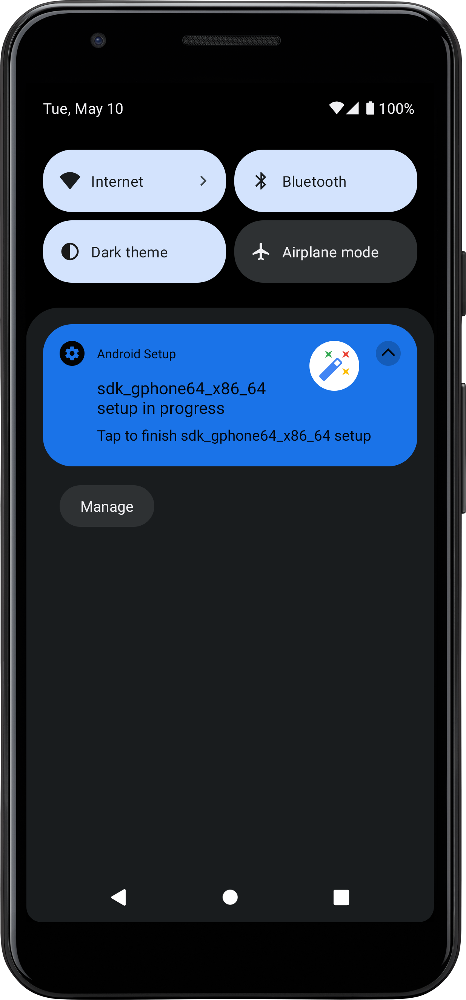
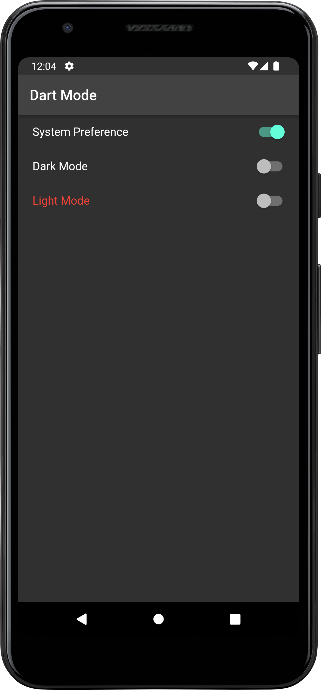
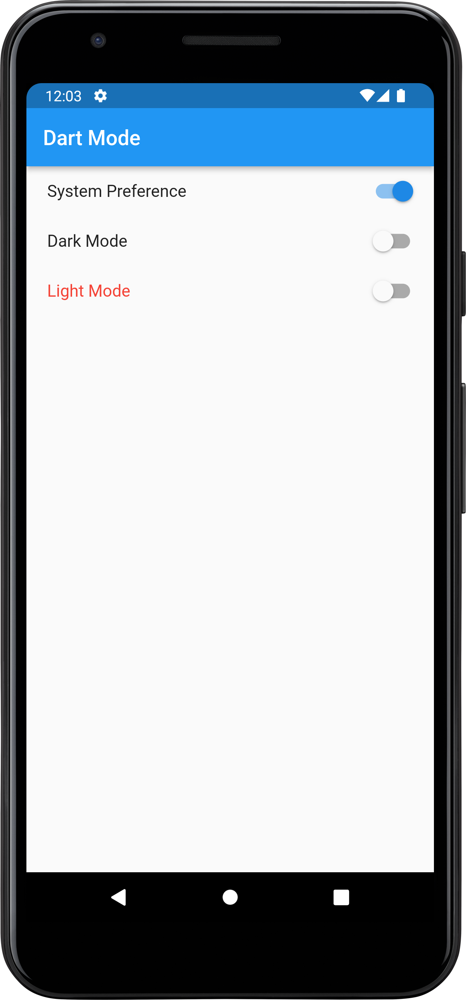
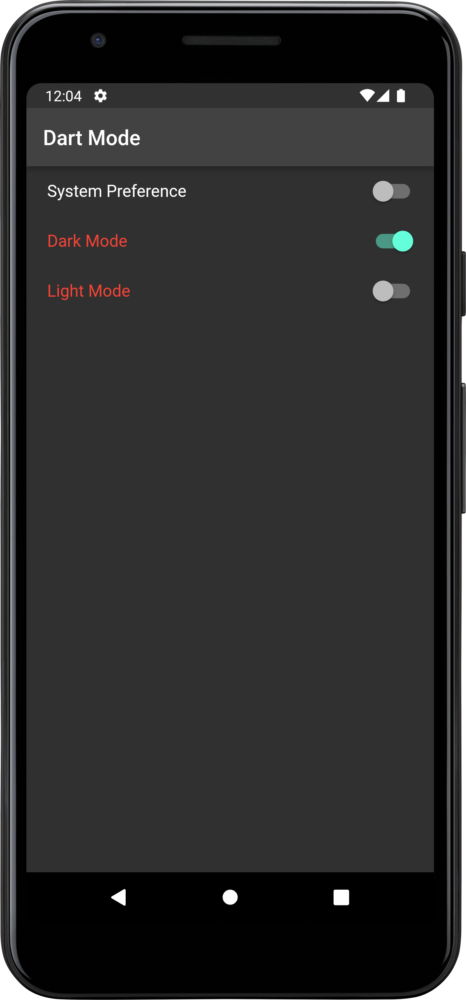
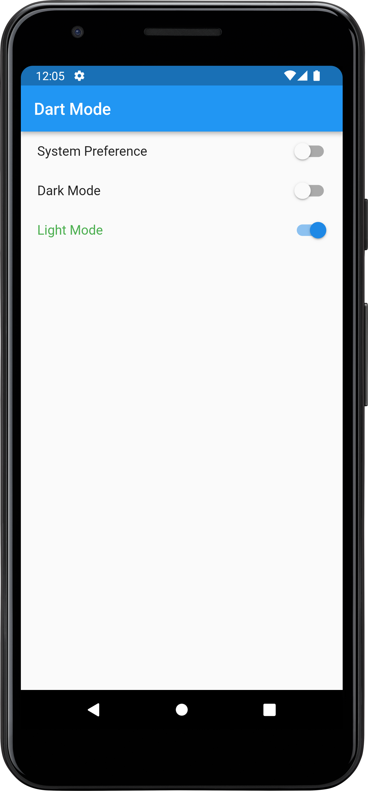
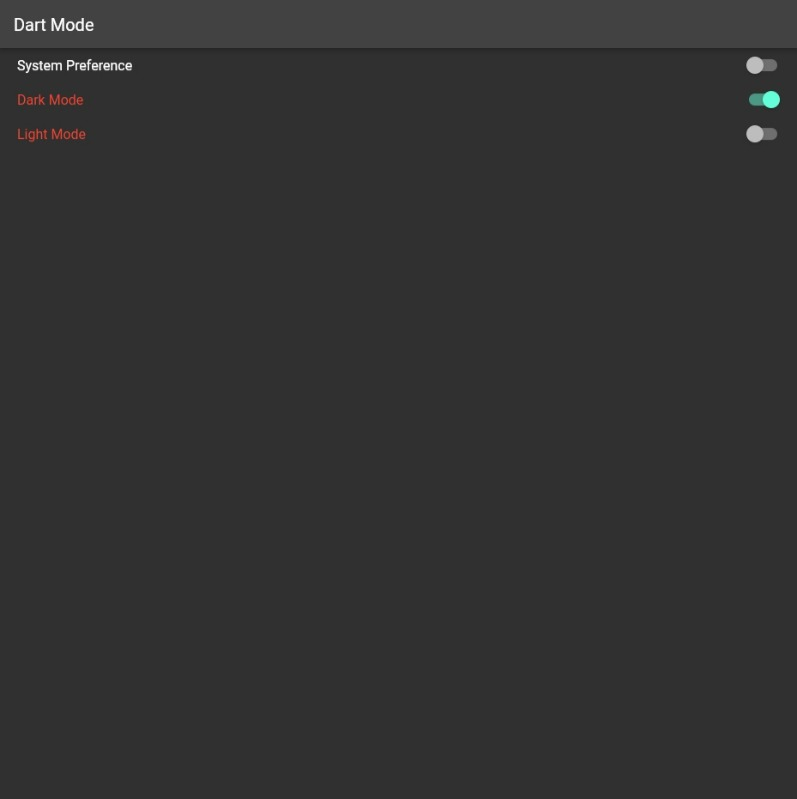
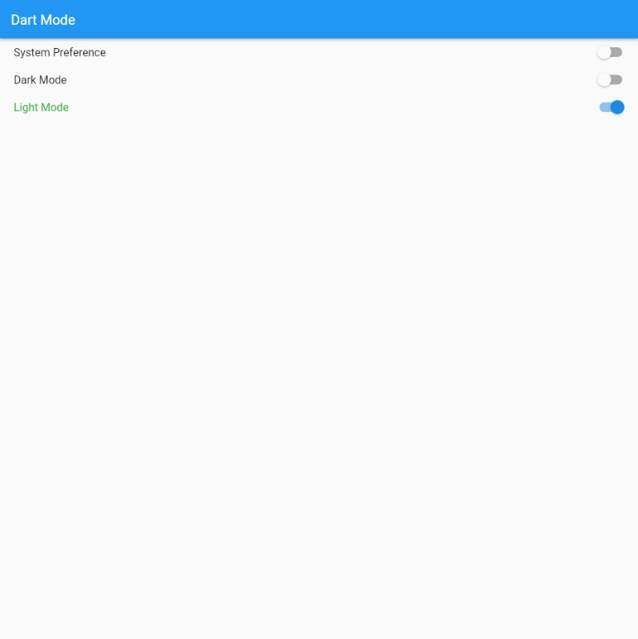
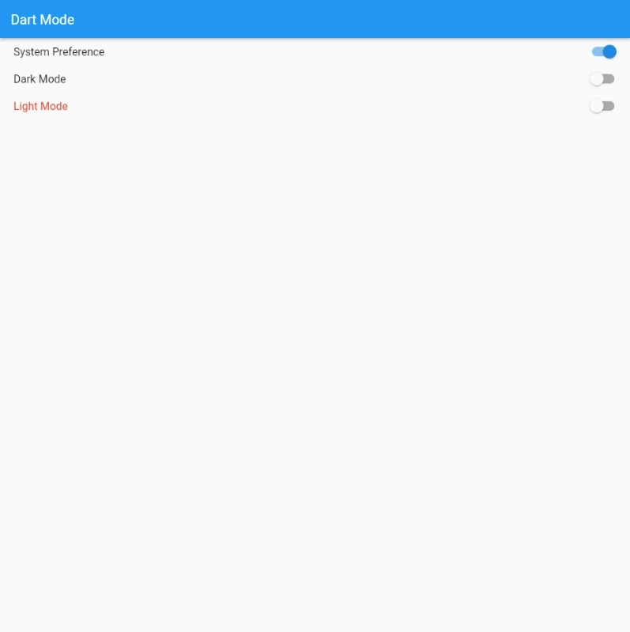

# Dark Light Theme
This is a Flutter Application with dynamic theme changes. Here system define mode , dark mode and light mode also text is dynamically change with theme mode.

## Live Site:

Link: 

## Download APK:

Link: https://terabox.com/s/1EaOPDp68VxnX-fdmkRW6dA

## Phone Screenshots:

| System Dark Enable     |  System Dark Mode |  System Light Mode |
| :---:       |    :----:   | :----:   |
|        |       |    |

| Dark Mode Enable     |  Light Mode Enable | 
| :---:       |    :----:   |
|        |       | 

## Web Screenshots:

| WebView Dark Mode    |  
| :---:       |   
|    | 

|  WebView Light Mode |
|    :----:   | 
|       |

|   WebView System Light Mode |
|    :----:   |
|        |

### Disclaimer
This project is made only for educational purpose. Anyone can use it but the risk has to be taken by the user.
for any query please contact me.

### Repository Owner Info

__Md. Al-Amin__  
__Email :__ [ alamin.karno@outlook.com ](mailto:alamin.karno@outlook.com)  
__Github :__ [Md. Al-Amin](https://github.com/karno786) 
__Facebook :__ [মোঃ আল-আমিন খন্দকার কর্ণ](https://facebook.com/alamin.kanro786)  
__Linkedin :__ [Md. Alamin Karno](https://www.linkedin.com/in/alaminkarno/)
 
 
